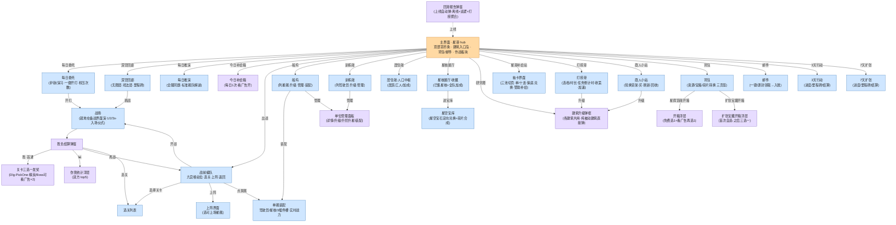

# GDD 附录B · UI/UX 页面规格（B0 地基 + B1 核心主轴 · 第2版）

> 隶属 `GDD-v2.0.md`。**Ron 2026-06-24 授权 Claude 全权把控 UI 设计与落地**（UI 非 Ron 专业、只在真机体验后给反馈）；故本附录按已锁风格（GDD §1.1⑥ + B0.1）+ 现有灰盒，由 Claude 一次铺完，不逐页等拍板。真机体验后 Ron 再针对手感给修改意见。
> **结构**：B0 地基（通用口径+组件库+跳转总图，定义一次）→ B1 核心主轴 → B2 养成建筑群 → B3 获取经济 → B4 仓储活动系统弹窗。
> **工作流**：本附录写清每页 → **Codex 据此出 UI 全景效果图** → 发回 → 照效果图调工程布局/按钮/弹窗。
> **真源原则（DRY）**：通用件在本文件 B0 定义一次，各页只写"用 XX 组件"，**绝不复制**。精确配色板/材质/图标画风属**附录A 美术 Bible**，本文件只给"骨架 + 视觉倾向"，不抢 A 的活。

---

## B-出图清单（喂 Codex 工作单 · 一次 ≤8 张，分 3 批）

> 把本附录发给 Codex 后，让他按下表**分 3 批**出图（每批 ≤8 张 = Codex 单次上限）。**第 1 批先出**——它定全局风格基准；回图确认风格 OK 后再出后两批，保证三批风格统一。
> **每张 = 一张竖屏 UI 效果图**（上色视觉稿，单屏一张）；我方据此把工程灰盒换成正式布局。
> **通用规格（所有图都遵守）**：竖屏手机比例；顶部留安全区（胶囊菜单区不画控件）；风格照 B0.1（明亮轻科技+Q萌+偏卡通·大圆角厚描边·暖橙主按钮·Q弹反馈）；详情/装配类页用**附录D 样张（赤焰/磐石/赫炎等）当占位示例**填内容；全中文标注；**不画 DEV-TEMP 工具行**（正式版没有）；每图标注关键控件名。
> 训练舱≈船坞、7天扩张≈3天行动为**同构页，各只出 1 张代表**，另一个工程直接复用。

**第 1 批 · 风格基准 + 核心主轴（6 张）**

| # | 页 | 照 | 画什么（要点） |
|---|---|---|---|
| 1 | 主界面·星港 hub | B1.1 | **招牌屏·定全局风格**：货币条 + Q萌建筑入口岛 ×8（含训练舱）+ 出战大钮 + 活动/背包/邮件 |
| 2 | 战前编队 | B1.2 | 上方敌情预览 + 我方 3×3 九宫格站位 + 底部三键 |
| 3 | 战场·战斗一帧 | B1.3 | 我方下/敌方上 + 炮火投射特效 + 倍速键 + 伤害飘字（体现质变爽感） |
| 4 | 单舰装配 | B1.4 | 驾驶员/星核/3插件槽 + 实时战力牌 + 品质色边（示例：赤焰） |
| 5 | 胜负结算（胜）+ 三选一发奖 | B1.5 | 结算卡 + 三选一奖励卡横排 |
| 6 | 通用组件库总览 | B0.3 | 一张拼图：货币条/主按钮/看广告键/确认弹窗/奖励飘字/红点/倒计时/页签/锁态——**给后两批当统一基准** |

**第 2 批 · 养成 + 获取（6 张）**

| # | 页 | 照 | 画什么（要点） |
|---|---|---|---|
| 7 | 船坞·星舰升级 | B2.1 | 拥有星舰列表 + 管理键 + 升级入口（训练舱同构复用） |
| 8 | 单位管理面板 | B2.3 | 详情（阶级/等级/槽位/战力）+ 升级/升阶/装配（示例：赤焰） |
| 9 | 居住舱·人口中枢 | B2.4 | 居民/工人 + 离线加成数据块 |
| 10 | 星核展厅·收藏 | B2.5 | 星核展柜陈列 + 🌌宝库入口 |
| 11 | 抽卡·星港补给站 | B3.1 | 三池切页 + 连抽翻牌出货 + 保底进度 + 赞助补给 |
| 12 | 打捞港 | B3.2 | 选档/时长 + 任务倒计时列表 |

**第 3 批 · 经济 + 仓储活动弹窗（6 张）**

| # | 页 | 照 | 画什么（要点） |
|---|---|---|---|
| 13 | 商人小站 | B3.3 | 轮换货架 + 回收区 |
| 14 | 星空宝库 | B3.4 | 兑换/合成行 + 限定核光效 |
| 15 | 背包（宝箱页） | B4.1 | 三页签 + 宝箱开箱入口 |
| 16 | 邮件 | B4.2 | 邮件列表 + 一键领取 |
| 17 | 活动·7天扩张 | B4.3 | 进度阶梯 + 里程碑（3天行动复用） |
| 18 | 通用弹窗组 | B4.4/B4.5/B2.6 | 一张拼三小弹窗：回港报告 / 星辉货舱开箱 / 建筑升级弹框 |

> 共 **18 张 / 3 批**，每批 6 张（≤8，留了余量给风格变体）。出完 = 全游戏 UI 视觉稿齐活，工程照图落地。

**第 4 批 · 包A 新系统（5 张 · 2026-07-02 新增，排在前三批风格锁定后）**

| # | 页 | 照 | 画什么（要点） |
|---|---|---|---|
| 19 | 回港报告弹窗 | B4.4 | 舰队归港演出 + 三段收益明细 + 一键全领/翻倍双键 |
| 20 | 每日委托 | B5.1 | 护航/演习两卡 + 积压次数 + 一键开打（护航画运输船+星门航道、演习画蓝色全息靶场——**与主线视觉区分是本图重点**） |
| 21 | 深空回廊 | B5.2 | 竖向层数塔 + 当前层 + 戏法层/回响Boss 特殊标记 + 里程碑宝箱 |
| 22 | 每日推演 | B5.3 | 棋局感：敌阵沙盘 + 候选舰横排 + 上阵格 |
| 23 | 主界面·作战板块（局部） | B1.1 | 出战大钮 + 回廊/委托/推演三枚次级入口 + 今日补给箱礼盒岛（补第 1 张的增量） |

---

## B0.0 · UI 写作铁律（对齐 D 的口径，固化）

1. **以现有灰盒为蓝本**：阶段一 A~L + 主界面 + 邮件已实现并真机验过。**功能元素 / 布局 / 跳转照实记录**（代码里已有、最准）；本附录新增的活儿主要是**给美术看的"目标视觉描述"**。即：骨架=灰盒现状，长相=美术版目标。
2. **大白话、能照着画**：每页写到"Codex 不用问就能画出效果图"的程度，不堆行话。
3. **顶部安全区强制**（铁律，引用不复制）：刘海/状态栏/胶囊菜单区禁放任何控件，绘制起始 Y 在安全偏移之下（工程用 `getS7UsableBand` / `wx.getMenuButtonBoundingClientRect`）。详见 `CLAUDE.md` 微信专属规则二.00。
4. **竖屏 + 像素比适配**（引用不复制）：竖屏单手操作；高清屏按 `pixelRatio` 分配物理像素。详见 `CLAUDE.md` 微信专属规则二.0。
5. **定义一次、别处引用**：通用控件/弹窗/飘字一律走 B0 组件库；某页要"略改"只写差异点。
6. **顺手埋音效点**：每页关键交互（点击/领奖/失败/开箱）我在交互描述里标一个 `🔊事件名` 占位，供以后**附录C C2 事件音效清单**收割；附录C 本身仍推迟、不展开。

---

## B0.1 · 视觉风格定调（Ron 2026-06-24 拍板）

> **【主画风锁定 · Ron 2026-06-24 画风海选拍板】= "软萌星港" painted 成品风 = `2026-06-18_星舰小队界面概念`（方案A 软萌星港 为主、糖果科技为辅）。**
> 该批概念图（基地海岛 / Q萌驾驶员在星空战斗 / 抽补给 / 战前备战）+ `2026-06-20`（打捞/商人/星空宝库）= **本作画风真源（≈附录A 美术 Bible 的雏形）**，所有 UI 出图与最终界面对齐它。
> **重要教训（见记忆 `codex-art-spec-vs-paint`）**：成品级好看 = **放开当原画画**（painted 场景/建筑/角色/特效），**别做扁平排版稿、别逐个标控件名**（那会把画面拽平）；附录B 这份是**布局蓝图**，与 painted 原画**分层**，最终合成。
> 锁定基调见 GDD §1.1⑥（轻科幻+Q萌拟人+幽默热闹、明亮可爱）。海选淘汰：纯扁平UI稿、深空冷酷霓虹（C）——Ron 仍选 06-18 软萌暖调最顺眼。

- **总气质**：明亮、暖、亲和、热闹，**painted 成品质感**（像真实可爱太空经营游戏截图）。第一眼像"可爱的太空经营游戏"，不像冷峻硬核军事 HUD、也不是干净线框 UI。
- **形状语言**：painted 软萌星港——**圆润 Q萌的建筑/星舰立绘** + **圆角面板** + 暖色光影 + 轻盈发光点缀；UI 控件自然融进画面，不做"厚描边卡通贴纸"也不做"扁平色块"。
- **配色倾向**（仅倾向；**精确配色板属附录A**）：底色明亮（浅蓝/奶白/暖灰），主行动色用**高饱和暖色**（橙黄系，对应已实现的"出战/确认"橙），辅助功能色用清爽的蓝绿紫做区分；撞色但不刺眼。
- **动效气质**：Q 弹、轻快、有反馈——按钮按下回弹、奖励飘字蹦出、数字滚动；不做沉重的过场。情绪价值优先（呼应入场仪式 §4.5），但不影响数值、不拖节奏（呼应北极星"平滑不憋屈"）。
- **字号档位**（四档，**具体字库属附录A**）：① 大标题（页名/弹窗标题）② 正文/按钮字 ③ 数值强调（货币数、战力、伤害——可略大略粗，给爽感）④ 小注（说明/锁态/倒计时）。
- **控件四态**（全局统一，组件库各件遵此）：**常态 / 按下（回弹+轻高亮）/ 禁用（去饱和灰显+不可点）/ 高亮（可领/可升/新内容，配红点）**。
- **占位规范沿用**：原型期色块占位，按"种族/类型分色 + 文字标注用途"（CLAUDE.md 七.4）；美术替换时一目了然。

---

## B0.2 · 屏幕骨架与通用栅格（三段式）

> 绝大多数二级页都套这个三段式，各页只填"主体区"。

```
┌─────────────────────────┐
│ 〔安全区〕胶囊菜单 禁放区        │  ← 安全偏移之上，永远空着
├─────────────────────────┤
│ 顶部条：返回/关闭 · 页名 · 货币条     │  ← B0 组件：Btn-Back + 标题 + Cur-Bar
├─────────────────────────┤
│                         │
│        主体内容区              │  ← 各页自己填（列表/网格/详情/弹窗）
│   （列表滚动 / 九宫格 / 详情）      │
│                         │
├─────────────────────────┤
│ 底部操作区：主行动按钮 / tab / 升级条  │  ← B0 组件：Btn-Primary / Nav-Tabs / Bar-OneTap
└─────────────────────────┘
```

- **顶部条**：左=返回/关闭键；中=页名；右=货币条（显本页相关 2~4 种主货币，可点看说明）。
- **底部操作区**：放该页的主行动（出战/抽卡/升级/确认）或页签切换；按拇指热区放（竖屏单手）。
- **层级三级**：**L0 主界面 hub**（基地/星港）→ **L1 二级页**（全屏/半屏面板，从 hub 或战斗进）→ **L2 浮层**（盖在某页之上的弹窗/开箱/统计，点外或关闭退回）。

---

## B0.3 · 通用组件库（定义一次，各页引用）

> 格式：**`代号` 名称** — 用途 / 元素 / 交互行为 / 视觉。各页只写"用 `代号`"，要改只写差异。

### 基础控件
- **`Cur-Bar` 货币条** — 用途：顶部显当前页相关货币。元素：每种=图标+数量（大货币种类见 GDD 经济图：星矿/星舰合金/驾驶记录/星贝/补给券/专属碎片/通用碎片/星核碎片/星空宝石/信标/插件/居民工人）。交互：单条可点→弹该货币"怎么来/怎么用"说明（`🔊tap`）。视觉：圆角胶囊小条、图标在左数字在右、数字档③。
- **`Btn-Back` 返回/关闭键** — 二级页用"返回XX"（退回上级、保留状态）；浮层用"关闭"或右上角 ✕。交互：点→退一层（`🔊back`）。视觉：左上或浮层右上，描边圆角。
- **`Btn-Primary` 主行动按钮** — 页面主操作（出战/抽卡/升级/确认/领取）。视觉：高饱和暖色、大圆角厚描边、字档②加粗；按下回弹（`🔊confirm`）。
- **`Btn-Ad` 看广告按钮** — 用途：广告点（加速/翻倍/赞助/再选一）。元素：📺图标 + "看广告 + 效果"文案。交互：点→播 mock 广告→回调发放（`🔊ad`）。视觉：与主按钮区分（青绿/带📺角标），**永不暗示"必须看"**（口径以 `GDD-v2.0.md` S13.1 广告哲学五原则为准：只锦上添花不设过路费、错过零惩罚；广告可带小幅战力增益、不必卡死为 0）。
- **`State-Disabled` 禁用灰显态** — 用途：买不起/到顶/券不足/未达条件。表现：去饱和灰、不可点、点了无反应或弹一句原因 Toast。（已实现：券不足十连变灰点了不抽；满级/买不起变灰。）
- **`State-Locked` 锁态入口** — 用途：未解锁建筑/即将开放功能。表现：入口变暗+🔒+"未解锁/即将开放/lvX解锁"小注；点→提示解锁条件（`🔊locked`）。

### 弹窗 / 浮层（L2）
- **`Modal-Scrim` 模态遮罩** — 所有 L2 浮层底层半透明黑遮罩；**点遮罩空白处=关闭/取消**（已实现 `addModalDismiss`）。
- **`Dlg-Confirm` 确认弹窗** — 元素：标题+一句话+【确认】【取消】。用于一般确认。
- **`Dlg-DoubleConfirm` 二次确认** — 用于不可逆/高消耗操作（如花大量碎片升阶、重置）。比 Confirm 多一道"确定要…？"강调。
- **`Dlg-PickOne` 三选一弹窗** — 用途：关卡发奖三选一 / 行动宝藏 / 开箱选项。元素：3 张奖励卡横排（图标+名+量）+ 顶部说明 +（精英/Boss/广告档）`Btn-Ad` 再选一。规则：**必须选 1 才能离开**（已实现，防"杀进程丢奖"）。`🔊pick` `🔊reward`。
- **`Fx-RewardFloat` 奖励飘字** — 用途：领奖/掉落/入账即时正反馈。表现：奖励图标+「+N」从中心蹦出上飘淡出；多件依次蹦；数字档③（`🔊reward`）。爽感关键件。
- **`Toast` 轻提示** — 用途：一句话反馈（"券不足""已达每日上限""已领取"）。表现：屏幕中下方短暂浮条、自动消失、不挡操作。

### 列表 / 导航 / 状态
- **`Nav-Tabs` 页签切页** — 用途：多页签界面（背包资源/宝箱/碎片转换；抽卡三池；管理面板详情/升级/升阶）。表现：顶部横排 tab，选中高亮+底部条；切页不重载（已实现）。
- **`Card-ListItem` 列表卡片** — 用途：单位/商品/任务/邮件等列表项。元素槽位：左图标 + 中（名+一行描述/状态）+ 右（数值/按钮/倒计时）。统一圆角卡、可滚动列表。
- **`Bar-OneTap` 一键条** — 用途：一键升级 / 一键装配 / 一键领取（已实现一键卸装/装配、邮件一键领取）。表现：醒目通栏按钮，一下处理整批，配 `Fx-RewardFloat` 批量飘。
- **`Timer-Bar` 倒计时条** — 用途：打捞任务/活动周期/限时。元素：进度条+剩余时间文字（`hh:mm:ss`）；可挂 `Btn-Ad` 加速或 DEV 秒成。每秒刷新。
- **`Badge-Dot` 红点** / **`Badge-Count` 数字徽标** — 红点=有可领/可升/新内容（已实现 hub 建筑"可升↑红点"）；数字徽标=未读/数量（邮件未读数、背包新增）。挂在入口右上角。
- **`Chip-Power` 战力牌** — 用途：备战/装配页实时显示战力。表现：⚡+大数字（档③），随装备/编队即时变（已实现，星核+插件均计入战力，见记忆 `power-core-counts-override-v1`）。

---

## B0.4 · 全局界面跳转总图（串所有界面 · 查断点死路）

> 依据现有工程实现绘制（`S7DemoController` 各 `open*/close*`）。L0=主界面，L1=二级页，L2=浮层。**回港报告弹窗**在上线时自动弹。



> **查断点用法**：每个二级页都应有返回路径回 hub（已覆盖）；每个浮层都能点遮罩/关闭退回；发奖类浮层（PICK）"必须选才离开"。铺各页时若出现"进得去出不来"或"入口无来源"，在此图标红。

---

## B0.5 · 图标用途总清单（占位 · 随各页补全）

> 各页 ⑥"图标用途清单"在该页内列；这里只先立**全局复用图标**的占位，避免重复定义（精确画风属附录A）。
- 货币/资源图标 ×约12（对应 `Cur-Bar` 货币种类）
- 功能入口图标：建筑×8（船坞/训练舱/打捞港/居住舱/补给站/商人/研究塔/星核展厅）+ 背包/邮件/活动
- 状态图标：🔒锁、红点、📺广告、⚡战力、📊统计、⏱倒计时、↑可升
- 单位相关：星舰定位型×5、驾驶员战术角色、星核类型、插件三品质（精良/优秀/传奇）槽位
- （以上为占位计数；逐页规格化时落到具体清单。）

---

## 自检（B0）

1. **通用件无遗漏**：B 框架点名的货币条/返回/确认/二次确认/奖励飘字/三选一/一键升级条全部入库，并补了灰盒里真有的（看广告键/红点/倒计时条/页签/锁态/战力牌/Toast/模态遮罩）。✅
2. **跳转图对得上工程**：基于 `S7DemoController` 真实 `open*/close*` 绘制，非凭空——hub 12 入口 + 战斗主轴 + 各浮层层级，已核对入口来源与返回路径无死路。✅
3. **不抢附录A 的活**：配色/材质/图标只给"倾向 + 占位计数"，精确配色板/画风明确甩给附录A，避免造第二真源（DRY）。✅
4. **与 D 解耦**：B 只定容器/组件/跳转，未写任何具体单位内容；详情页留"槽位"，内容由 D 填——并行不互卡。✅
5. **风格落 Ron 拍板**：明亮轻科技+Q萌+偏卡通已写进 B0.1（形状语言/配色倾向/动效气质/控件四态）。✅

> B0 详细度/模板 + 组件库 + 跳转图已成形；Ron 授权后不再逐项等拍，直接以此为模板铺 B1~B4。真机体验后再调。

---

## B0.6 · 交互通则十二条（2026-07-04 立·所有新界面从出生守规矩，交互巡检批按此验收）

> 来源：块1/块2 真机验收反复踩的同类坑（升级不刷新/文案溢出/按钮组错用语境/档位0起显示）固化成规。**每个新界面交付前逐条自查**；巡检批（2.5块全完后）按此扫存量界面。

1. **操作即时反馈**：任何点击 100ms 内有可见反应；操作改变的数值与状态**当帧刷新**当前界面（反例：升级Lv不刷新）。
2. **文本永在容器内**：文案锚定所属卡片/面板，超长自动缩字/换行，禁止悬空溢出（反例：词缀文案悬出卡外）。
3. **返回路径明确**：全屏页有返回、弹窗有关闭或单一主键；返回目的地=来源界面（先例：悬赏出战回悬赏板）。
4. **按钮组随语境裁剪**：复用界面时不属于当前语境的按钮必须隐藏（先例：悬赏备战不出现「选择关卡」）；主行动键视觉最重、放拇指热区。
5. **弹窗不叠罗汉**：同屏最多一个模态弹窗，连续结算按序出（三选一→大奖特写→结算）；必选弹窗防杀进程丢奖。
6. **控件四态齐全**：可点/按下/禁用/锁定；禁用与锁定给一句原因（如"首个Boss后解锁"）。
7. **入账必有回执**：任何奖励入账有飘字或明细行；翻倍/扣减显示差值（先例："已翻倍✓"/"遇袭损失-XX·库存未动"）。
8. **玩家侧数字从 1 起**（反例："星域档 0"）；内部索引随意。
9. **进行中状态可见**：战斗/倒计时/异步任务，界面上能看出"正在进行+剩余"，不许"点了没动静其实在跑"。
10. **新内容首见给一句话说明**（弱引导级、不锁屏）。
11. **DEV 工具与正式 UI 隔离**：测试键统一工具行、样式明显区分、记 DEV-TEMP 待删清单。
12. **随停恢复**：任何界面切后台回来状态不丢；战斗遵 GDD S4 中断口径（切后台续播/杀进程该场未发生）。

**先例补充（2026-07-05·块4 真机修复批·Ron 拍板全玩法通用）：**
- **操作完成即收弹窗**（并入 ③/⑤ 精神）：所有备战/摆位界面，底部弹窗完成主操作后自动收起——**先例：备战「上阵界面」点「上场」后自动收起**（下场保持开可继续调）。别让玩家点完还要再点一次关。
- **分玩法阵容记忆**（并入 ⑫ 随停恢复的"状态不丢"）：辅助战斗按玩法各记各的上次阵型——**先例：主线/回廊/护航/演习四把钥匙各记各的编队摆位**（跨玩法不串·换玩法自动回到该玩法上次的搭配；装配跟船全局不分叉；推演不适用=每题标准舰队）。

---

# B1 · 核心主轴（5 页）

> 玩家每天必走的主路：进家 → 排兵 → 开打 → 看戏 → 结算。Codex 最先要画的就是这 5 屏。每页套 6 段模板：① 用途 ② 功能元素（含安全区）③ 布局骨架 ④ 视觉描述 ⑤ 交互与跳转 ⑥ 图标清单。**骨架=现有灰盒实现，长相=美术版目标。**

## B1.1 · 主界面 · 星港 hub（L0 门户）

**① 用途**：游戏的"家"与门户。上线第一屏——看基地变热闹、领离线/打捞收益、进所有子系统、点出战。

**② 功能元素**
- 〔安全区〕顶部胶囊区禁放任何控件。
- 顶部：`⭐ 星港` 标题 + `Cur-Bar` 货币条（**常驻 3 种**：星矿/星贝/补给券，§10.5；各 chip 可点看说明）。
- 活动区：`3天行动` / `7天扩张` 两枚入口（显进度，可领时挂 `Badge-Dot`）。
- **建筑入口岛（10 栋·空间层级布局·Ron 2026-07-05 hub 信息架构拍板）**：每枚 = 建筑图标 + 名 + 一行状态（`Lv.X`、可升挂 `↑红点`，§建筑升级入口决策）；解锁前 `State-Locked`。按使用频率分三层（详见 ③ 布局骨架）：
  - **中心三角（主视觉锚点）**：`船坞·养成` + `训练舱·驾驶员养成`（居中稍大）+ 顶点 `星核展厅·收藏`（两者上方=全场主视觉锚点）。
  - **内圈（高频）**：`星港补给站·抽卡` / `商人小站·买卖` / **`作战大厅`**（靠近出战大钮）。
  - **外圈（中低频·基地边缘）**：`打捞港·打捞` / `居住舱·人口` / `研究塔·升级` / **`深空回廊`**（显当前层数·首Boss后解锁）。
- **作战大厅（Ron 2026-07-05 新架构·内圈建筑）**：一个容器入口，内含两个页签 **`悬赏板`**（原独立「悬赏」入口挪入·护航/演习词缀战·显积压 `Badge-Count`）+ **`每日推演`**（显今日已解/未解）。解锁 = 关5 强引导后（悬赏口径）；**推演页签内再门控 = 打通 n040 后**（未通显锁定提示）。未来辅助战斗新玩法一律进此容器当新页签（见下"封顶铁律"）。**深空回廊维持独立入口**（不进大厅·外圈建筑·首Boss后解锁）。
- **出战大钮**：`出战` 大主按钮（`Btn-Primary`·主线·右下拇指热区）——与背包/邮件/活动图标同**浮在 UI 层**（不占建筑岛格）。
- **🔴 封顶铁律（Ron 2026-07-05 写死）**：**主界面建筑封顶 10 栋**；后续新玩法一律进「作战大厅」页签，不再往主界面加建筑入口。
- **今日补给箱**（活动区旁的小礼盒岛）：每日 1 次看广告开（S13 #2）；**零红点**（S13.1 广告零红点铁律），已开则当日隐入背景。
- 底部：`背包`（资源/宝箱，新增挂 `Badge-Count`）+ `邮件`（未读数 `Badge-Count`）。
- 上线时：`回港报告弹窗`（L2，自动弹，见 B4.4·包A 改造）。**星港趣事**：进 hub 偶发（每日≤1）小弹泡：居民 Q 版头像+一句趣话+微量奖励，点一下收下（L2 轻浮层，不打断操作）。
- 〔DEV-TEMP·上线删〕底部小工具行：领离线 / 发测试邮件 / 重置存档。

**③ 布局骨架（Ron 2026-07-05 空间层级·10 栋）**：顶部货币条 → 活动两枚 → **建筑岛按"中心三角 + 内圈 + 外圈"三层空间铺**（非均匀网格）：
- **中心三角**：船坞 + 训练舱居中稍大（养成主循环），星核展厅在两者上方顶点 = 全场主视觉锚点（收集炫耀点）。
- **内圈（高频·围中心）**：补给站 / 商人 / 作战大厅——**作战大厅靠近右下出战大钮**（辅助战斗与主线出战同区顺手）。
- **外圈（中低频·基地边缘）**：打捞港 / 居住舱 / 研究塔 / 深空回廊。
- **UI 浮层（不占建筑岛·不变）**：出战大钮（右下拇指热区）+ 背包/邮件（左下）+ 活动两枚（上）。
**基地全景立绘做背景**，建筑随等级演进（外观分级属附录A A4）。灰盒期为色块入口、精确空间三角待美术阶段落地。

**④ 视觉**：明亮热闹的星港全景打底；建筑入口画成 **Q萌建筑小岛**（不是冷冰冰按钮），有"我的地盘在长大"的温暖感；`出战` 暖橙最醒目；整体偏卡通、轻科技点缀（能量管线/星港灯）。

**⑤ 交互与跳转**：各入口→对应二级页（见 B0.4 总图）；货币 chip 点→说明（`Chip-Currency`，🔊tap）；出战→战前编队（去最新关）；可升/可领→`Badge-Dot`；上线回港报告弹窗→领取走 `Fx-RewardFloat`（🔊reward）；未解锁建筑→`State-Locked`。

**⑥ 图标**：货币×3、建筑×10（含作战大厅/深空回廊）、背包/邮件/活动×4、`↑可升`/红点/未读徽标。

## B1.2 · 战前编队（L1）

**① 用途**：出战前最后一屏。看敌情、排九宫格站位、调上阵/装配、开战。

**② 功能元素**
- 〔安全区〕顶部避让。
- 标题 `★ 战前备战 ★` + 信息行（当前节点 / 我方总战力 / 敌情概要）。
- 上半：**敌情预览**（敌方阵型/规模概览）。
- 下半：我方 **3×3 九宫格**（居中；每格=上阵星舰图标 + `⚡战力` 角标 / 空格可放）。
- 底部三键：`选择关卡` / `返回星港` / `🚀 开始战斗`（`Btn-Primary`）。
- 开战时：UI 整体隐藏、就地演战斗 + `跳过` 键（见 B1.3）。

**③ 布局骨架**：上半敌情预览 ↔ 下半九宫格（上下对称居中）→ 底部三键。站位含前/中/后排语义（影响目标优先级，§4）。

**④ 视觉**：战场预演感——上方敌人剪影/阵型，下方我方九宫格站位卡（Q萌星舰图标 + 战力角标）。`开始战斗` 暖橙最大、带蓄势感。

**⑤ 交互与跳转**：点格→`上阵界面`（B1 内联：选/换星舰）；格↔格拖动→换站位（🔊swap）；点已上阵舰→可进上阵/装配；`选择关卡`→选关浮层（灰盒跳关工具，正式主线地图 §8 另做）；`开始战斗`→**入场仪式**（我方从屏下滑入 ~0.5s，§4.5）→就地自动战斗；`跳过`→直接结果。🔊sortie。
- **分玩法阵容记忆（③b·Ron 2026-07-05·真机修复批）**：备战按玩法各记各的上次阵型——主线/回廊/护航/演习**四把钥匙**，进哪个玩法就载入哪个的编队摆位（跨玩法不串·首进从当前全局播种再分叉）；装配（驾驶员/核/插件）跟船全局记忆、不随玩法分叉。**推演不适用**（每题标准舰队·见 B5.3）。悬赏备战的护航/演习按卡主题分钥匙。

**⑥ 图标**：`⚡战力`、站位排标（前/中/后）、敌情类型、🚀开战、跳过。

### B1.2a 上阵界面（从战前编队点格弹出 · 半屏 sheet）
- **用途**：选哪艘星舰上这一格 / 上下场。**元素**：标题"上阵—选星舰" + 左侧拥有星舰列表（**已上阵靠前、战力高靠前**）+ 右侧选中舰详情 + `装配` / `上场·下场` 切换钮 + `返回`。**布局**：上半留敌情、下半 sheet（点 sheet 外空白=返回，`Modal-Scrim`）。**交互**：选舰→右侧详情；`装配`→单舰装配（B1.4）；`上场/下场`→切换该舰上阵态；**点「上场」后底部 sheet 自动收起**（③a·Ron 2026-07-05·点完即走·下场保持开可继续调）。

## B1.3 · 战场 · 自动战斗演出（L1，就地）

**① 用途**：纯自动战斗的观赏屏。玩家不操作，看小队自动打、享受质变爽感（"卡关→牛核→质变碾压"的爽点引擎，§高概念）。

**② 功能元素**
- 就地在备战屏演（站位=备战站位）：我方 3×3 九宫格演出、敌方 5×7 阵列。
- 技能/炮火特效（**原地发射投射物/能量，无近身砸**，对齐 D 写作铁律⑥；弹种走附录D 通用攻击视觉库）。
- `倍速键` 1/2/3x（右下，循环切）；`跳过` 键；受击数字飘字。
- 计时/胜负：清场=胜、超时 **120s** 判负。
- **单位战斗 HUD（Ron 2026-06-25 拍板 · `Unit-BattleHUD`）**：每艘我方星舰**上方**一组「**驾驶员头像（左）+ 血条（右）**」（传统"头像+血条"组合，小而统一、别太大）。**头像=驾驶员（认人/身份）；血条=星舰的血**（驾驶员不加血，对齐附录D）；**星舰本体不再画驾驶员**（呼应附录D"星舰弱拟人·不给脸、驾驶员承载情感"）。血条可预留挂**极小状态图标**（中毒/护盾/buff）与**技能 CD 细条**（要"看懂质变"时再加，MVP 头像+血条即可）。**敌方简化**：小怪只给细血条、**头目才给头像**（省素材、分主次）。固定阵位（不移动）正好留得出头顶空间。
- **战斗用俯视素材 + 转向瞄准（Ron 2026-06-25 拍板）**：战场上的星舰/敌人=**俯视图 sprite**（透明底、我方机头朝上/敌方机头朝下为基准朝向）；展示界面（装配/船坞/收藏）用 **3/4 精美立绘**（双套素材，仅我方星舰两套；驾驶员仅 3/4、战斗为头像；敌人仅俯视）。**转向瞄准**：开火时星舰**整体转向当前目标**、换目标时再转向新目标；**转向是看得见的转动动画**（约 0.2s、随倍速缩放、非瞬移），无目标时回正朝上。固定阵位"不移动"仍成立（只转向、不位移），对齐附录D 铁律。详见附录A 素材规格。

**③ 布局骨架**：沿用备战屏坐标，我方下/敌方上，投射物来回。每艘船头顶挂 `Unit-BattleHUD`（头像+血条）。倍速/跳过在右下安全热区（避顶部安全区）。

**④ 视觉**：Q萌但有火力感；明亮特效（激光/炮弹/能量束）；**星核质变要"画面更爽"**（如陨星弹把普攻变陨星轰击）；入场滑入；命中处特效 + 伤害飘字（情绪价值，不改数值）。星舰=载具不给脸、身份靠头顶头像。

**⑤ 交互与跳转**：近乎只读；`倍速` 循环 1→2→3x（`effStep=stepSec/speed`）；`跳过`→直接结算；战斗结束→`胜负结算弹窗`（B1.5）。🔊skill/🔊hit/🔊win/🔊lose。

**⑥ 图标**：1/2/3x 倍速、跳过、各定位型技能特效关键词（落地属附录A A5）。

### B1.3a 战斗演出规格（伤害字 / 震屏 / 击杀 / 破墙雪耻 / 开场演出 · 统一口径 · 2026-07-03 新增）
> 与 B1.3 战场同层，定义"演出何时该有反应、何时不该"，防止特效泛滥砸性能（微信性能红线：减少高开销特效、少用 `shadowBlur`）。B7 开场演出拍板①落在本节最后一条。
- **伤害字三级制**：① 普攻/常规伤害——小字号（数值档③常态）、蹦一下即消；② 技能伤害——字号更大 + 技能色，蹦跳幅度略高；③ 暴击 / 终结技伤害——特大字号 + 描边发光 + 短暂放大回弹，**全场最显眼的数字**，专留给"这一下不一样"的时刻。三级只靠字号/描边/蹦跳幅度区分，不逐帧加特效（防掉帧）。
- **震屏白名单**（仅这 3 处允许屏幕震动，其余场景一律不震——震多了等于没震）：**Boss 登场**（压迫感开场）／**星核质变触发**（普攻变大招那一下的"哇"时刻）／**清场最后一击**（本场终结）。震屏强度轻（几像素位移 + 数帧），不做重度镜头晃动。
- **击杀标准演出**：任意敌方单位被消灭——本体白闪一帧→缩小/淡出+小范围粒子爆点（复用通用特效模板，不做逐个专属特效），不打断战斗节奏、不挡下一目标的攻击判定；Boss/精英击杀额外加一次**轻微顿帧**（0.1-0.2s，非全屏震屏）强调分量。
- **破墙雪耻结算**：同一节点**连续失败 ≥2 次后首次通关**判定为"破墙"——胜负结算弹窗（B1.5）叠一层"破墙成功"横幅演出（更多飘字/更亮光效/一句鼓励文案），复用 B1.5 既有结算卡、不额外开新页；**仅视觉加强，奖励内容不变**（不额外发奖，呼应"重复挑战不发首通大奖"红线）。
- **开场 10 秒陨星弹演出（概述 · 对应 B7 拍板①）**：全游戏唯一一次的开场引擎演出，第 1 关战斗开始前播放：陨星弹一炮轰击→镜头带出清场画面（预告"这就是后期的爽感"）→切至"舰队离港"，只留玩家一艘破船留守——为"把小破星港养回去"的目标立画面。约 10 秒、**引擎内实时演出**（非预渲染视频，省包体）、**只播一次**（关1 开局，之后不重复出现）。详细分镜随战斗演出块落地时再展开，本节只定"有这场戏、多长、演什么"。

## B1.4 · 单舰装配（L1 浮层）

**① 用途**：给单艘星舰装/卸 **驾驶员 / 星核×1 / 插件×3**（按船记忆），实时看战力变化。

**② 功能元素**
- 〔安全区〕标题（舰名）+ 提示行（标记说明：`★本舰 / ▶在别船 / 未装`）。
- 装备区：驾驶员位 / 星核位×1 / 插件位×3 + 可选装备列表；`⚡实时战力牌`（`Chip-Power`）。
- 底部：`一键卸装` / `返回` / `一键装配`（`Bar-OneTap`）。
- 子弹窗：`装备详情弹窗`（点装备→标题+信息+取消/装备或卸下）；`移动确认弹窗`（装备在别船→`Dlg-DoubleConfirm` 二次确认两船互换）。

**③ 布局骨架**：顶部标题+提示 → 中部槽位（驾驶员/星核/3 插件）+ 可选列表 → 底部三键。**开槽 gating**：C 阶 1 插件槽 / B 阶 2 / A 阶 3 / **S 阶开星核槽**（未开槽灰显 `State-Disabled`）。

**④ 视觉**：槽位卡（空槽虚框；已装显图标 + **品质色边**：精良/优秀/传奇）；战力牌随装即时跳变给爽感；`★/▶/未装` 标记清晰。**驾驶员位错配亲和组时**（软兼容，见附录D 驾驶员真源 §0）驾驶员位旁显**黄字提示**"该能力/天赋在此舰不生效"（不锁装配，仍可自由搭配；每级驾驶加成不受影响）。

**⑤ 交互与跳转**：点装备→详情弹窗→装/卸；装备在别船→移动确认（两船互换）；`一键装配/卸装`→批量 + `Fx-RewardFloat`；**战力实时变**（星核+插件均计入，记忆 `power-core-counts-override-v1`）；点卡外/`返回`→回上阵界面。🔊equip/🔊unequip。

**⑥ 图标**：驾驶员/星核/插件槽位、三品质色边、`⚡战力`、`★本舰`/`▶在别船`。

## B1.5 · 胜负结算（L2 浮层，含三选一发奖 / 伤害统计）

**① 用途**：战斗结束反馈——显示胜/负、战报、领奖、决定下一步。

**② 功能元素**
- `Modal-Scrim` 半透明遮罩（**透出背后战斗画面**，不切场景）+ 结算卡。
- 标题（`★ 战斗胜利 ★` 绿 / `战斗失败` 红）+ 战报 msg（**胜=残血%＋推进/救回人口·奖励明细在三选一屏不在此**；伤害概要看 📊）。
- `📊 伤害统计` 键（**胜负都有**→看双方 top5，见下）。
- 三键：`选择关卡` / `返回星港` / `下一关 ▶`（胜）或 `再次挑战`（败）。
- 胜利**首通·三选一屏＝唯一奖励屏**（Ron 2026-07-04 真机拍板·终稿·块2真机落地）：战斗胜利后先盖 **三选一屏**（`Dlg-PickOne`）＝**唯一列奖励的地方**——顶部**固定奖励列表**（必得软货币）＋（精英/Boss）**必给大奖预告**（陨星弹/星辉货舱）＋ 三张**选卡**；**必须选 1**（吞触摸·防杀进程丢奖）。**选完**：三张卡**锁定**（选中高亮✓/其余灰），**同屏下方浮现**（**仅精英/Boss**）`Btn-Ad`「看广告·**固定奖励**×2」（S13 #3）＋「继续」。**#3 只翻固定奖励**（结算软货币＋固定补充驾驶记录/星贝·**就地翻倍＋飘字"+X→+2X"＋键变"已翻倍✓"**）；**唯一核（陨星弹）/ 三选一选中项 / Boss 星辉货舱均不翻**。**Boss 首通**：点「继续」后、结算卡出现前，弹**大奖特写弹窗**（大字奖名＋图标占位＋效果说明〔如陨星弹"普攻质变为原子炮"·取自星核真源〕＋「收下」·仪式感·正式演出随战斗演出块升级）。**普通关**：三选一（必选）→ 选完直接走（无广告/继续；#3 待 2.5块⑤广告网关补齐再套此"选完浮现"结构）。**结算卡不再列奖励明细**（奖励全在三选一屏·两屏不重复）——只留 `★战斗胜利★`banner ＋ `📊伤害统计` ＋ 三键。〔S13 #4「三选一再选一」当前**暂不含·留后**。〕
- **战败**：结算卡附**安慰补给**小块（合金/驾驶记录小额，**白送直接入账**，每日 ≤3 次；随附 `Btn-Ad`「安慰双倍」每日 2 次，S13 #9）+ **败因归类＋克制建议＋跳转按钮**（B8① · 见 B1.5b：一句"为什么输 + 怎么破 + 一键去修"，**不推广告**，守五原则第 5 条）。

**③ 布局骨架**：结算卡居中（标题上、战报中、伤害统计键中下、三键底排）；**三选一屏（唯一奖励屏）/ 大奖特写 / 伤害统计**浮层盖其上。

**④ 视觉**：胜=绿 + 庆祝飘字/光效（爽感）；败=**柔和不挫败**的提示（让人愿意再来一次，§产品原则六.4）；三选一卡横排吸睛。

**⑤ 交互与跳转**：结算弹窗**吞触摸**（必须点按钮、不点空白关）；`下一关`→已推进的下一关备战；`再次挑战`→重打当前；`选择关卡`→选关浮层；`📊`→伤害统计浮层；**奖励流程（首通）：三选一屏必选 1 → 选完同屏浮现（精英/Boss）「看广告·固定奖励×2」(#3·就地翻倍)＋「继续」→ 继续后（Boss）弹大奖特写「收下」→ 露出结算卡**（唯一核/选中项/星辉货舱不翻）。🔊win/🔊lose/🔊reward/🔊pick。

**⑥ 图标**：📊统计、三选一奖励图标、📺广告翻倍、胜利星标。

### B1.5a 伤害统计浮层（L2，盖在结算上）
- **用途**：复盘本场输出。**元素**：标题 + 我方/敌方各 top5 单位的伤害条（名+伤害数+占比条）+ `关闭`。**视觉**：横向伤害条排行，数字档③。**交互**：点关闭/遮罩→回结算弹窗。

### B1.5b 战败·败因归类与克制建议（结算卡内嵌 · B8① · Ron 2026-07-03 拍板，推翻 v1.0"不做失败分析"旧取舍）
- **用途**：战败时给一句"为什么输 + 怎么破"，兑现"失败愿意再来"（§产品原则六.4）；**轻量**、不做重报告（对齐"失败界面轻量"）。
- **元素**：结算卡战报区显示 **1 个败因标签**（四选一自动判定）+ **1 条具体克制建议** + **1 个跳转按钮**（一键去修）：

  | 败因 | 判定口径（精确阈值实现期定） | 克制建议 | 跳转 |
  |---|---|---|---|
  | **输出不足** | 超时(120s)判负、敌方剩血偏多 | "升级/升阶提战力，或换高输出定位型" | → 船坞·星舰升级（B2.1） |
  | **后排被点** | 我方支援/炮击型明显先于前排阵亡 | "肉盾/护卫摆前排挡刀，脆皮往后放" | → 备战九宫格（B1） |
  | **被控** | 我方大量时间处于沉默/眩晕等受控 | "装抗控插件，或换克制该敌的驾驶员" | → 单舰装配（B2.3） |
  | **耗死** | 长时间拉锯、我方被逐步磨光 | "上治疗/续航，或提防御减伤" | → 单舰装配 / 换船 |

- **判定优先级**：多因并存按"最主要"取一（权重实现期定）；无法明确归类→回退通用建议"试试升级/换搭配"。
- **交互**：跳转按钮点了直接进对应修复页（省玩家自己找）；**不推广告**（守五原则第 5 条）。🔊lose。
- **实现期**：随战斗演出/结算块落地（需战斗埋点：超时/阵亡顺序/受控时长/拉锯时长）；本节先定 UI 与四类口径。

---

## 自检（B1）

1. **5 页全照工程实**：hub 入口/货币、九宫格备战、就地战斗演出、单舰装配槽位 gating、结算三键 + 首通三选一 + 伤害统计——逐项核对 `S7DemoController` 真实实现（`buildHubHome`/`buildPrebattlePanel`/`buildLoadoutPanel`/`buildResultPopup` 等），未凭空加界面。✅
2. **复用 B0 组件**：货币条/主按钮/看广告/三选一/飘字/二次确认/战力牌/红点/遮罩点关全部走 B0 代号，未重复定义（DRY）。✅
3. **与 D 解耦**：装配/上阵/战斗页只写"槽位/星舰图标/技能特效位"，未写任何具体舰名核名，内容由 D 填。✅
4. **风格一致**：明亮+偏卡通+轻科技点缀、暖橙主按钮、Q弹反馈、失败不挫败——贯穿 5 页 ④ 视觉段，落 B0.1 与 §1.1⑥。✅
5. **埋音效点**：每页 ⑤ 标了 🔊 事件（sortie/swap/skill/hit/win/lose/equip/reward/pick…）供 C2 收割，附录C 仍推迟未展开。✅
6. **留意灰盒态**：选关是灰盒跳关工具（正式主线地图 §8 另做）、DEV-TEMP 工具行上线删——均在 ② 标注，不当成正式界面写死。✅

---

# B2 · 养成建筑群（5 页 + 2 共用弹窗）

> 玩家把货币变强的地方：升星舰/驾驶员、看人口/收藏加成、各建筑统一升级。**建筑升级入口（Ron 2026-06-21 决策）= 各建筑界面内统一升级栏 + 纯被动建筑点 hub 直接弹小升级框；不做集中"基地管理"总览页。**

> **口径更新（Ron 2026-07-03·取消建筑卡等级）**：星舰/驾驶员**等级上限只由阶级/星级决定**（C20/B40/A60/S80/SS100，见 GDD-v2.0 S5.5），**不再是"船坞/训练舱楼级×5"**。船坞/训练舱**仍可升级、但暂无战斗外收益**（替代收益＝升级成本折扣线，待第三块数值校准定）。

## B2.1 · 船坞 · 星舰升级（L1）
- **① 用途**：升级拥有的星舰（数值骨架成长）+ 进单舰管理（升阶/装配）。
- **② 元素**：〔安全区〕标题 `船坞·星舰升级` + 信息行（`船坞 Lv.X · 升级暂无战斗外收益`）+ 拥有星舰列表（每行：名 + `阶级·Lv/上限` + `管理` 键，`Card-ListItem`；上限=阶级决定 C20/B40/A60/S80/SS100）+ 底部 `返回星港` / `升级船坞`（→建筑升级弹框）。
- **③ 布局**：标题/信息 → 列表（滚动）→ 底部两键。
- **④ 视觉**：星舰卡带定位型色 + 等级/阶级徽标；可升的舰挂 `↑红点`。
- **⑤ 交互**：`管理`→单位管理面板（B2.3，内含升阶）；`升级船坞`→建筑升级弹框（B2.6）。**三笔花费分开算**：升船坞（本页 `升级船坞` 键）花**星矿**；升星舰等级（B2.3 内 `升级`）花**合金**；升阶（B2.3 内 `升阶`）花**专属碎片**——三条互不占用。**星舰等级封顶=当前阶级上限**（到顶提示"升阶解锁更高"，非升船坞）。🔊upgrade。
- **⑥ 图标**：定位型×5、阶级、`↑可升`、星矿（升船坞）/合金（升舰）/专属碎片（升阶）。

## B2.2 · 训练舱 · 驾驶员升级（L1）
- 结构同 B2.1，单位换成**驾驶员**：信息行 `训练舱 Lv.X · 升级暂无战斗外收益`；列表每行 名 + `N★·Lv/上限` + `管理`（上限=星级决定 1★20/…/5★100）；底部 `返回星港` / `升级训练舱`。升级花 **驾驶记录**，**封顶=当前星级上限**（到顶提示"升星解锁更高"）。**⑥ 图标**：战术角色、星级、驾驶记录。

## B2.3 · 单位管理面板（船坞/训练舱共用 · L2）
- **① 用途**：单个星舰/驾驶员的总览与操作中枢。
- **② 元素**：详情区（舰=阶级(战力+%)/升阶需X专属碎片(有Y)/等级Lv/cap/插件槽/星核槽/战力 + **属性详情·技能详情（待接入·预留位）**；员=星级(战力+%)/升星需碎片/等级/cap + **驾驶能力·驾驶天赋详情（待接入）**）+ 底部四键 `升级` / `升阶`或`升星` / `装配`（仅舰）/ `返回`。
- **③ 布局**：详情居中文块 → 底部按钮排。置顶盖在船坞/训练舱之上。
- **④ 视觉**：详情卡 + 槽位可视（插件槽数随阶、星核槽 S 阶亮起）；升阶/升星按钮用质变紫、可升时高亮。
- **⑤ 交互**：`升级`→花对应货币升一级（封顶提示）；`升阶/升星`→`Dlg-DoubleConfirm` 扣专属碎片（C→B=20/B→A=40/A=60…），**开槽 gating 随之解锁**（C=1 插件/B=2/A=3/S 开星核槽）；`装配`→单舰装配（B1.4）。升阶/升星加成**计入战力**（显示+实战）。🔊ascend/🔊upgrade。
- **⑥ 图标**：阶级/星级、插件/星核槽、`⚡战力`、专属碎片。**（"属性/技能详情"待 D 内容 + 数值接入后填——这是 B 与 D 的预留接口，不阻塞。）**

## B2.4 · 居住舱 · 人口中枢（L1）
- **① 用途**：看人口（居民/工人）及其带来的离线/折扣加成，升居住舱。
- **② 元素**：标题 `居住舱·人口中枢` + 信息块（`Lv` / 居民N人·工人N人 / 离线储存上限h / 离线产率+% / 居民加成：产率+%·储存+h / 工人加成：建筑升级星矿-%）+ 底部 `返回星港` / `升级`。
- **③ 布局**：标题 → 信息块（居中文字）→ 底部两键。
- **④ 视觉**：温暖生活感的居住舱内景；居民/工人用 Q萌小人计数；加成用图标条列。
- **⑤ 交互**：`升级`→建筑升级弹框（升离线上限/产率）。人口来源=主线救回/打捞/7天扩张（K 块），此页只读展示。🔊。
- **⑥ 图标**：居民、工人、离线储存(⏱)、产率(↑)、折扣(-%)。

## B2.5 · 星核展厅 · 收藏（L1，→星空宝库入口）
- **① 用途**：陈列已收集星核 + 全队收藏加成；通往星空宝库。
- **② 元素**：标题 `星核展厅·收藏` + 信息块（`Lv` / 已收集星核 N 种：列表 名×份数 / 全队收藏加成 +X%·**种类越多越强·封顶10%**）+ 底部 `返回星港` / `升级` / `🌌 星空宝库`。
- **③ 布局**：标题 → 收藏陈列（星核展柜感）→ 底部三键。
- **④ 视觉**：博物馆/展厅式星核展柜，每颗星核发光摆件；未集齐的留暗格（收集驱动）。
- **⑤ 交互**：`🌌 星空宝库`→星空宝库（B3.4）；`升级`→建筑升级弹框（升收藏加成系数）。🔊。
- **⑥ 图标**：星核类型、展柜暗格、收藏加成。

## B2.6 · 建筑升级弹框（通用 · 各建筑共用 · L2）
- **① 用途**：任何建筑的统一升级框（研究塔等纯被动建筑点 hub 直接弹此；功能建筑从其界面"升级XX"进）。
- **② 元素**：`Modal-Scrim` + 卡片：建筑名 + `当前 Lv → 下一级` + **本级→下一级效果对比** + 花费（星矿，**工人折扣**）+ `升级` 主钮（满级/买不起 `State-Disabled`）+ `关闭`（点卡外关）。
- **③ 布局**：居中卡片，效果对比上、花费中、按钮下。
- **④ 视觉**：圆角卡 + 等级进度感；效果用"现在 vs 升级后"两列对比给爽感。
- **⑤ 交互**：`升级`→扣星矿（工人折扣）→效果即时生效 + `Fx-RewardFloat`；满级/买不起灰显。研究塔(全队血攻+%)/星核展厅(收藏加成)等效果接入战斗。🔊upgrade。
- **⑥ 图标**：各建筑、星矿、`↑等级`、工人折扣。

> **自检（B2）**：船坞/训练舱列表+管理、单位管理详情(含待接入预留)、居住舱人口加成、星核展厅收藏+宝库入口、通用升级弹框——逐项对 `buildUnitTrainPanel`/`buildUnitManagePanel`/`buildInfoBuildingPanel`/`buildBuildingUpgradePanel` 核实。✅ 与 D 的接口("属性/技能详情待接入")显式标为预留位、不阻塞。✅ 复用 B0 组件（二次确认/遮罩/飘字/红点/禁用态）。✅

---

# B3 · 获取经济（4 页）

> 玩家"搞到东西"的地方：抽卡、打捞、商人、宝库。

## B3.1 · 星港补给站 · 抽卡（三池 · L1）
- **① 用途**：用补给券抽本体（星舰/驾驶员）。三池轮换 + 保底 + 专属兑换。
- **② 元素**：〔安全区〕标题 + 补给券余量；**三池切页**（`Nav-Tabs`：招募补给/专属补给/舰船补给）+ 当前池说明（今日开放类别 / 当期专属）+ **保底进度条** + `单抽`/`十连`（扣补给券，**券不足该档 `State-Disabled` 灰显点了不抽**）+ 出货明细（标阶级/星级/专属，专属恒 `A级·专属`）+ **专属兑换进度** + `领兑换箱`（×2 叠领）+ `赞助补给`（`Btn-Ad` 看广告得券）+ `返回星港`。
- **③ 布局**：顶部券+三池切页 → 中部当前池说明+保底 → 出货展示区 → 底部 单抽/十连 + 赞助补给。
- **④ 视觉**：补给站舱口/扭蛋机感；连抽出货逐张翻开、稀有度光效（阶级越高越炫）；保底进度条醒目。
- **⑤ 交互**：切池→`switchGachaPool`（进/出刷新走轮换补发）；抽→出货飘字+稀有光效（`Fx-RewardFloat`，🔊gacha/🔊reward）；地板保底（每N抽必出≥A/3★·已拥有折60·重复折碎片15，**折算值待第三块按新升阶碎片阶梯重算**）；兑换箱当场领（不经邮件）；轮换忘领→走邮件补发（去邮件领）；`赞助补给`→看广告 mock 得券。
- **⑥ 图标**：补给券、三池标、阶级/星级、专属标、保底进度、📺赞助、兑换箱。
- 〔灰盒态〕分类/出率/保底抽数全 v0.1 占位（第二块校准）；补给站→出率钩子留第二块。

## B3.2 · 打捞港（L1）
- **① 用途**：派信标打捞，真实时钟异步等，收回稀有物。
- **② 元素**：标题 + `选信标档`（普通/稀有/史诗）+ `选时长`（2/8/24h）+ `开始打捞` + **任务列表**（每条：档位/`Timer-Bar` 倒计时/`收菜`/`Btn-Ad` 看广告加速/〔DEV〕秒成）+ `升级打捞港` + `返回星港`。
- **③ 布局**：上部 选档+选时长+开打 → 中部任务列表（滚动）→ 底部两键。
- **④ 视觉**：港口/打捞队出航感；任务卡带倒计时进度条；可收菜的高亮。
- **⑤ 交互**：开打→占打捞队位（**打捞队上限=打捞港等级**，扣 1 张对应信标）；到点→`收菜`掷奖结算（必得软货币+1种通用碎片+概率发现分层）+ 飘字；`看广告加速`按档减时（每日上限·跨天重置）；`升级打捞港`→建筑升级弹框（加队位）。🔊salvage/🔊reward。
- **⑥ 图标**：信标×3档、时长、⏱倒计时、📺加速、收菜、打捞港。
- 〔灰盒态〕产出表/概率/上限 v0.1 占位；DEV「秒成」上线删。

## B3.3 · 商人小站（轮换制 · L1）
- **① 用途**：花星贝买轮换货 + 回收溢出物换星贝。
- **② 元素**：标题 + `刷新行`（免费刷 / `Btn-Ad` 广告刷）+ **货架列表**（每条：名/价/剩余 + `买`，买不起 `State-Disabled`）+ **回收区**（信标/溢出星矿→星贝，**按商人等级陆续解锁**：星矿 lv2 / 信标 lv4，未到等级灰显 `lvX解锁`）+ `升级商人小站` + `返回星港`。
- **③ 布局**：顶部刷新行 → 货架列表（滚动）→ 回收区 → 底部升级/返回。
- **④ 视觉**：星际小摊/杂货铺热闹感；常驻补给券格固定，轮换格每次刷新换一批；折扣/限量标签。
- **⑤ 交互**：进店/加载→`refreshMerchantToCycle`（跨天重铺+清购买量）；`买`→扣星贝+记购买量（货+次数一起刷新清零，防套利）；`刷新`→换一茬货（免费1+广告≤2/天，口径以 S13.2 #8 为准）；`回收`→折损换星贝；`升级`→货架格数随等级增（lv1→5…lv7→8）。🔊buy/🔊refresh。
- **⑥ 图标**：星贝、货品（信标/碎片/插件/星空宝石）、剩余量、📺刷新、回收、锁(`lvX解锁`)。
- 〔灰盒态〕定价/上限/权重/折损/解锁等级 v0.1 占位；DEV 升商人键上线删。

## B3.4 · 星空宝库（L1，从星核展厅进）
- **① 用途**：用星空宝石定向兑换星核（含限定核）/专属舰；用星核碎片随机合成星核。
- **② 元素**：标题 `🌌 星空宝库` + 余量（星空宝石 / 星核碎片）+ 说明（兑换=定向·一次性解锁；合成=碎片随机出1核）+ **行列表**：碎片随机合成行（`合成`，不足灰）/ 星核兑换行（名[限定]·宝石价·`兑换`/`已拥有`/`宝石不足`）/ 专属舰兑换行（名[专属]·宝石价·同上）+ `返回`。
- **③ 布局**：顶部余量+说明 → 行列表（合成行在上，兑换行其下）→ 底部返回。
- **④ 视觉**：神秘宝库/星空货架感；限定核用特殊光效标记（第一稀缺感）；已拥有的置灰打勾。
- **⑤ 交互**：`合成`→扣星核碎片随机出1核 + 结果飘字；`兑换`→扣星空宝石 grant 对应核/舰（一次性，已拥有不可再兑）。🔊synth/🔊redeem/🔊reward。
- **⑥ 图标**：星空宝石、星核碎片、星核类型、[限定]标、[专属]标。
- 〔灰盒态〕合成/兑换池 = core01-06（core07 与限定核不进池）；专属舰=shp10/11；限定核内容随铺量填。

> **自检（B3）**：抽卡三池/保底/兑换/赞助、打捞选档时长任务、商人轮换货架+回收解锁、宝库兑换合成——逐项对 `buildGachaPanel`/`buildSalvagePanel`/`buildMerchantPanel`/`buildVaultPanel` + README 各交接核实。✅ 三个广告点（赞助补给/打捞加速/商人刷新）均走 `Btn-Ad`、措辞不逼迫（红线）。✅ 占位/DEV 态标注清楚。✅

---

# B4 · 仓储 / 活动 / 系统弹窗（4 页 + 开箱族）

## B4.1 · 背包（三页签 · L1）
- **① 用途**：暂存与查看所有资源/宝箱/碎片，开箱、转碎片。
- **② 元素**：〔安全区〕顶部 `Cur-Bar`（3 chip 可点看说明）+ `Nav-Tabs` 三页签：
  - **资源页**：所有背包资源 + 各单位专属碎片 + 拥有插件数。
  - **宝箱页**：三类宝箱数量（星辉货舱`开箱`／行动宝藏／扩张宝藏`开箱`）。
  - **碎片转换页**：通用碎片余量 + 舰/员切页 + 可转单位列表（选）+ 数量（`−`/`+`/`最大`）+ `转换`（通用→指定单位专属·占位1:1）。
  - 底部 `返回`。
- **③ 布局**：顶部货币条 + 页签 → 页签内容区（列表/网格）→ 底部返回。
- **④ 视觉**：仓库格子/收纳感；宝箱用可开箱的发光宝箱图标；新增物挂 `Badge-Count`。
- **⑤ 交互**：切页签不重载；`开箱`→对应开箱浮层（B4.5）；`转换`→扣通用碎片转专属 + 飘字；货币 chip 点→说明。🔊tap/🔊reward。
- **⑥ 图标**：各资源/碎片/插件、三类宝箱、转换箭头、`最大`。

## B4.2 · 邮件（L1）
- **① 用途**：领取系统/活动/补发奖励（轮换补发、活动结算、跨期补发的总入口）。
- **② 元素**：标题 + 计数（未读/可领）+ 邮件列表（每条：标题/内容/奖励预览/状态：未读·可领·已领·已过期，`Card-ListItem`）+ `一键领取` / 逐封 `领取` + `返回`。
- **③ 布局**：顶部计数 → 邮件列表（滚动）→ 底部一键领取/返回。
- **④ 视觉**：信箱感；未读小红点、可领高亮、已领/过期置灰。
- **⑤ 交互**：`领取`/`一键领取`→入账（软货币→钱包·有非钱包键护栏；`exShard:<id>`→专属碎片库；chest→宝箱库；unit 本体→未拥有发本体/已拥有折15碎片）+ `Fx-RewardFloat`。🔊reward。
- **⑥ 图标**：信封、未读点、奖励类型图标、`一键领取`。
- 〔DEV〕hub「发测试邮件」键供真机验领取入账，上线删。

## B4.3 · 3天行动 / 7天扩张（活动 · L1）
- **① 用途**：周期挑战，攒进度领里程碑/完成宝藏。
- **② 元素**：标题（行动/扩张）+ **进度条**（自然累积：推关/打捞/抽卡按权重喂入）+ 里程碑节点（达成可**当场领**）+ 完成奖励 + `Timer-Bar` 周期剩余 + 〔DEV〕`+50进度/秒结算` 键。
- **③ 布局**：顶部进度条+周期倒计时 → 里程碑阶梯（领取点）→ 完成奖励。
- **④ 视觉**：进度阶梯/任务卷轴感；里程碑可领时高亮跳动；3天=短线热闹、7天=长线大奖（扩张感）。
- **⑤ 交互**：进度自然涨（不需手动做任务）；里程碑/完成→当场领（进背包/钱包/人口）+ 飘字；到期攒够→结算宝藏走邮件（离线到期也补结算）。3天完成=星辉货舱；7天完成=史诗信标+星核碎片；7天里程碑给人口。🔊reward。
- **⑥ 图标**：行动/扩张、进度、里程碑、⏱周期、宝藏箱。
- 〔DEV〕`+50进度/秒结算` 上线删（真机不可能等3/7天）。

## B4.4 · 回港报告弹窗（L2 · 上线自动弹 · 2026-07-02 包A 改造，取代原"离线收益弹窗"）
- **① 用途**：回到游戏的**唯一开场聚合弹窗**——把 离线产出 + 巡逻战报 + 已完成打捞 合并成一屏"舰队归港"结算，一键全领（GDD S10.10；开场广告决策点 ≤1 的落点）。
- **② 元素**：`Modal-Scrim` + "舰队归港"卡片：离线时长 + **三段收益明细**（🏭 基地产出：星矿为主 / 🛡 巡逻战报：合金·驾驶记录·星贝小额 / ⚓ 打捞入港：仅当有完成的打捞，列带回物）+ `一键全领`（`Btn-Primary`）+ `Btn-Ad`「看广告全部翻倍」（**仅软货币翻倍、打捞实物不翻**；每日 2 次，超限**按钮不出现**，S13 #1）。
- **③ 布局**：居中大卡，标题"欢迎回港，指挥官"上、时长与三段明细中（各段小图标分隔）、底部并排 `一键全领` + `翻倍`（两键同级、点哪个都立即走）。
- **④ 视觉**：舰队归港小演出打底（港口灯亮、小舰入位、居民挥手）；三段明细数字滚动堆叠；领取时 `Fx-RewardFloat` 大爆发——**每天上线的第一口爽**。
- **⑤ 交互**：上线检测到任一收益→自动弹（全为零则不弹）；`一键全领`/`翻倍`→入账+飘字+关闭回 hub；新手期首次触发→弱引导短说明（替代原"离线收益"首触，GDD-M）。离线/巡逻均=纯函数（经过秒数,状态）可复算。🔊reward。
- **⑥ 图标**：⏱时长、🏭基地产出、🛡巡逻、⚓打捞、📺翻倍。

## B4.5 · 开箱浮层族（`Dlg-PickOne` 家族 · L2）
> 三种宝箱共用"选项卡 + 免费选 + 看广告再选"骨架，盖在背包/结算之上。
- **星辉货舱开箱**：开箱给 **3 选项**（星核碎片/星空宝石/信标包）·**免费选 1 + `Btn-Ad` 看广告再选 1**（箱子在"免费选1"那刻才扣库存，没选不亏）。
- **扩张宝藏开箱**：**首次全池自选**，之后**随机三选一**（靠存档 `expansionOpenedCount` 判）。出星核（含限定核位）。
- **行动宝藏开箱**：三选一（可扩 H 的开箱 config，留后接）。
- **② 元素**：`Modal-Scrim` + 标题 + 横排选项卡（图标+名+量）+ `Btn-Ad` 再选一（适用档）+ 必选才离开。**④ 视觉**：开箱仪式感（箱子弹开、光束）+ 选项卡吸睛。**⑤ 交互**：选 1→入账+飘字；看广告→再选 1；未选不能关（防丢奖）。🔊open/🔊pick/🔊reward。**⑥ 图标**：三类宝箱、各奖励、📺再选一。

> **自检（B4）**：背包三页签（资源/宝箱/碎片转换）、邮件领取入账护栏、活动进度/里程碑/结算、回港报告弹窗、三类开箱族——逐项对 `buildBackpackPanel`/`buildMailPanel`/`buildActivityPanel`/`buildChestOpenPanel`/`buildExpOpenPanel` + README 核实。✅ 开箱族统一走 `Dlg-PickOne`「必选才离开」防丢奖（呼应 F 灰盒留账）。✅ DEV/占位态标注。✅

---

# B5 · 包A 新系统页面（3 页 · 2026-07-02 新增，GDD S10.7-S10.10）

> **B5.1 星港悬赏板 + B5.2 深空回廊 + B5.3 每日推演均已建灰盒**（第2.5块·块2/块3/块4）转为"照实记录 + 美术升级方向"，出图排第 4 批。**架构注（Ron 2026-07-05）**：悬赏板 + 每日推演已并入 hub「**作战大厅**」容器双页签（见 B1.1）；深空回廊维持独立入口。

## B5.1 · 星港悬赏板（护航 / 演习 · 词缀辅助战斗 · L1）
> 2026-07-04 整体重写（取代旧"每日委托·无脑速刷档"）。**已建灰盒**（第2.5块·块2·独立 view `S7BountyBoardView`），本组从"目标规格"转为"照实记录 + 美术升级方向"。旧规格见 git 历史。

- **① 用途**：每天的**词缀辅助战斗档**——看戏找搭配策略（S10.8）。独立全屏页（hub 入口「悬赏」）。
- **② 元素**：顶部说明行（"📋 星港悬赏板 · 星域档 N · 每天凌晨4点刷新"）+ 积压行（"板上 X / Y 张——没做的攒着，星港帮你留（不催办）"）+ **悬赏卡列表**（每天 4 张 + 未做积压·分页）。**每张卡**：左=主题×品质徽标（护航/演习 × 铜/银/金·品质描边色）；中=**词缀全文**（卡面全可见·每条一行 effectText）+ 产出预览（护航附"运输船满血=完美护航+25%"提示）；右=`出战`（`Btn-Primary`）。
- **③ 布局**：说明行 → 积压行 → 卡列表（竖排·每页 5 张·`◀上一页/第 p/P 页/下一页▶`）→ 底部 `返回星港`。
- **④ 视觉（美术升级方向）**：**与主线强区分**——护航卡=星门航道蓝 + 运输船 + 劫掠涂装敌；演习卡=全息训练绿 + 半透明靶机；品质用**铜/银/金描边 + 徽标**一眼可辨；整体"接单办事"的轻快感（区别于主线"征战"的郑重感）。当前灰盒=色块徽标 + 描边，真实涂装/靶机/运输船模型留美术阶段。
- **⑤ 交互**：`出战` → **进主线同款备战**（默认上次阵容·敌情预览切悬赏敌阵·信息行挂**本场词缀全文**=灰盒词缀标记；**悬赏备战底部=两键「返回悬赏板」+「开始战斗」**——主线专属的「选择关卡」不出现）→ 出战 → **场场真打**（2×/3× 倍速可用·看词缀生效找策略）→ 胜：结算窗**单键「返回悬赏板」**（藏"选关/下一关"·rule⑨）→ 返回后卡从板上消失、产出入账；负：单键返回·卡留板·不罚。护航触发**遇袭 = 风险抉择**（Ron 2026-07-04 修订）：结算窗两键——`⚔ 正面迎战`（同舞台接打：胜=额外小包/败=折损本单收益占位30%·明细现"遇袭损失 −XX"·存量不动）/ `🛡 躲避袭击`（零损失返航·板上现中性提示"舰队绕道返航"）。🔊dispatch/🔊reward。
- **⑥ 图标**：护航（运输船）、演习（靶标）、品质（铜/银/金徽章）、词缀（增益/减益小标）、积压包裹、遇袭（警示）。
- **⑦ 词缀标记（rule⑥）**：卡面词缀全文可见；备战界面被词缀影响的单位挂标记（图标 + 一句效果）。灰盒当前在备战信息行列出本场词缀全文（作用定位型），逐单位格图标标记留美术/演出阶段。

## B5.2 · 深空回廊（无尽塔 · L1）
> **已建灰盒**（第2.5块·块3·独立 view `S7CorridorTowerView`），本组从"目标规格"转为"照实记录 + 美术升级方向"。解锁 = 首个 Boss（n030）通关后。
- **① 用途**：无限层长线挑战——变强验证场 + 毕业后主循环（S10.7）。独立全屏塔页（hub 入口「回廊」）。
- **② 元素**：**竖向层数塔**（向上无限）：当前挑战层（高亮大卡：层号 + 类型〔普通/戏法·规则+解法/回响Boss〕+ 敌情概要）/ 上方几层剪影（戏法⚔ / 回响Boss👑 / 里程碑🎁 标记，让玩家看到前方）；**里程碑宝箱区**（每5层攒一个·可积攒·手动开：每个一行 奖励文案 +「开箱」+「开箱×2 📺」`Btn-Ad`·S13 #10）；顶部层数牌（下一层第 N 层）；底部：`挑战下一层`（`Btn-Primary`）+ 返回星港 + DEV 跳层行。
- **③ 布局**：顶部层数牌 → 塔身（当前层大卡 + 上方剪影 + 里程碑宝箱区）→ 底部挑战大钮 + 返回 + DEV 行。
- **④ 视觉（美术升级方向）**：越往上星空越深邃、层卡颜色渐变（星域主题色轮换）；戏法层用"扭曲星云"边框一眼可辨、回响Boss层紫色描边、里程碑宝箱金光；整体"探索未知深空"的神秘感（与主线"收复星域"的明亮感对比）。当前灰盒=色块大卡 + 类型描边色 + emoji 标记，真实塔身滚动/剪影/涂装留美术阶段。
- **⑤ 交互**：`挑战下一层`→**走主线同款备战**（回廊**不跳备战**——每层都值得摆阵，与悬赏相反；备战信息行=层号+戏法规则+解法+敌情·敌情预览画回廊生成敌阵·底部两键「返回回廊」+「开始战斗」·无「选择关卡」）→**场场真打**（2×/3× 倍速可用·看戏法生效找搭配）→ 胜：**首通**层数+1、发**每层小奖**（自动入账），遇里程碑提示"回塔手动开箱"；**重打已通层零奖励**；败=停留原层、结算给**养成建议**（戏法层给解法提示·**不推广告**）→ 结算窗**单键「返回回廊」**（藏"选关/下一关"·rule⑨）。**戏法层规则在塔页大卡 + 备战信息行都明示**（进关前可读·才谈得上换搭配）。**上阵上限戏法**（精锐限3/孤胆限1）：带多了出战被拦、提示下阵多余星舰。**里程碑**：塔页宝箱区手动开（可积攒），「开箱」直发 /「开箱×2」看广告（#10）全键翻倍。🔊tower_up（过层）/🔊tower_milestone（开箱）。
- **⑥ 图标**：层数、戏法层（扭曲星云/⚔）、回响Boss（👑）、里程碑宝箱（🎁）。

## B5.3 · 每日推演（战术谜题 · L1）
> **已建灰盒**（第2.5块·块4·**作战大厅内页签**·独立 view `S7DailyPuzzleView`）。本组从"目标规格"转为"照实记录 + 美术升级方向"，含 Ron 2026-07-05 三修订（战队包制/n040解锁/三闸）+ 真机修复批（布局重排/九宫格转向）。旧规格见 git 历史。解锁 = 打通 n040 首通后。
- **① 用途**：每天一道全服同题的搭配解谜——会玩的人的甜点（S10.9），**纯可选、无广告**。进入 = hub「作战大厅」建筑 → 「每日推演」页签（与「悬赏板」并列·回廊维持独立入口）。
- **② 元素（战队包制·修订②）**：题头（"第 X 题 · {威胁类型}"）+ 副标题（"全星港指挥官同题 · 每天凌晨4点换题"）+ 一句威胁提示 + **敌阵沙盘**（威胁单位高亮）+ **候选战队包区**（本题 6-8 包·**每包 = 星舰+驾驶员固定绑定 + 若有的核/插件**·点选高亮·已上阵置灰）+ 我方 **3×3 摆位格**（点包再点格放置·点已放格拿回）+ `开始推演`（`Btn-Primary`·满5才亮）+ 今日已解态（"🎉 今日已解 + 奖励 + 明日再会"）。未解锁(n040前)显 `State-Locked` 锁定提示。
- **③ 布局（真机修复批①·四区自适应顺排·区间零重叠·守 B0.6②）**：题头+威胁提示 → 敌阵沙盘 → 候选战队包（窄屏 2 行不压缩）→ 我方摆位+开打钮。各区独立呼吸空隙、永不叠；底部 DEV 行与内容隔开。
- **④ 视觉（美术升级方向）**：**棋局感/沙盘感**（全息投影桌面、蓝图线条），和真实战斗的实景区分——强调"这是推演不是实战"；解开时"妙手"庆祝特效。当前灰盒 = 色块格子 + emoji 标记 + 威胁高亮，真实全息桌面留美术阶段。
- **⑤ 交互（点选摆位·真机修复批②九宫格转向）**：点候选包选中 → 点九宫格空位放上去 → 点已放格拿回；**九宫格朝向对齐实际战斗**——我方**上排=前排**（贴近敌）、下排=后排；敌阵沙盘**下=敌前排**（贴近你）；`开始推演`→ 确定性战斗回放（就地在战斗舞台·摆位已在本页做·不走主线备战屏）；失败→"再想想"（**不限次数、零惩罚、无广告**）；成功→**首胜领一次奖 + 标记今日已解**（重复通关不重复发）；结算**单键「返回推演」**；未解完就走→明天换题不留欠账。🔊puzzle_start/🔊puzzle_solve。DEV 行（上线前删）：跳题 / 清摆。
- **⑥ 图标**：题号、沙盘、战队包卡、定位型标、核/插件标、已解勾。

> **自检（B5）**：三页均对齐 GDD S10.7-S10.9 的定性规则（速刷=跳备战/回廊=不跳备战/推演=零惩罚无广告）；广告键只出现在 S13.2 清单允许的位置（委托页无广告、回廊仅里程碑、推演零广告）；零红点铁律核过（委托的次数角标=信息计数，非广告红点）；视觉区分度是 B5.1/B5.3 的第一要求。✅

## 附录B 完成度小结

- **已成文**：B0 地基（口径+组件库22件+全局跳转总图）+ B1 核心主轴(5) + B2 养成建筑群(5+2) + B3 获取经济(4) + B4 仓储/活动/系统弹窗(4+开箱族) + **B5 包A 新系统(3，2026-07-02)**。**阶段一全部已实现界面 + 包A 新系统目标规格均已成文**，可整套发 Codex 出 UI 全景效果图（新系统排第 4 批）。
- **与 D 的接口**：单位管理/装配/详情页的"属性·技能·驾驶能力详情"为**预留位**，待 D 内容 + 数值接入填；B 不被 D 阻塞。
- **待补（不阻塞发美术）**：正式主线关卡地图/选关（§8 独立块，现为灰盒跳关）；正式版去 DEV-TEMP 入口。
- **退役提示**：`设计可视化` 的 4 张图属"设计联动流"非"UI 页面"，与本附录 B0.4「界面跳转总图」职责不同，**不在此并入**；其去留留 v2.0 整合阶段统一处理。
- **下一步**：Ron 安排 Codex 据此出效果图 → 回图后照效果图调工程布局；真机体验后针对手感反馈，我再迭代具体页。
