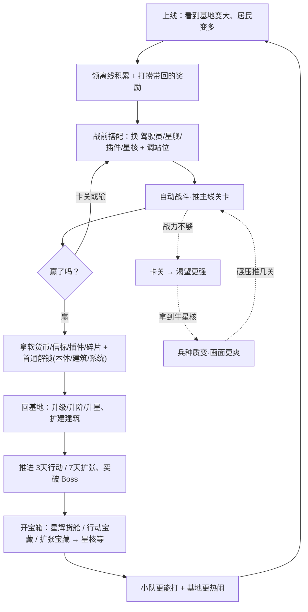
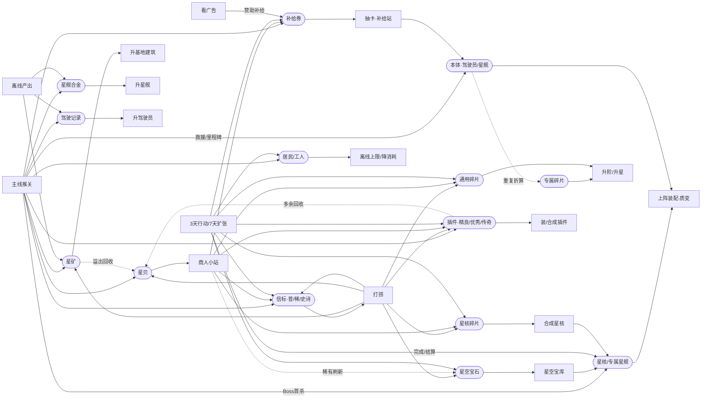
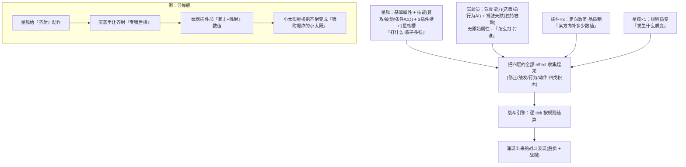
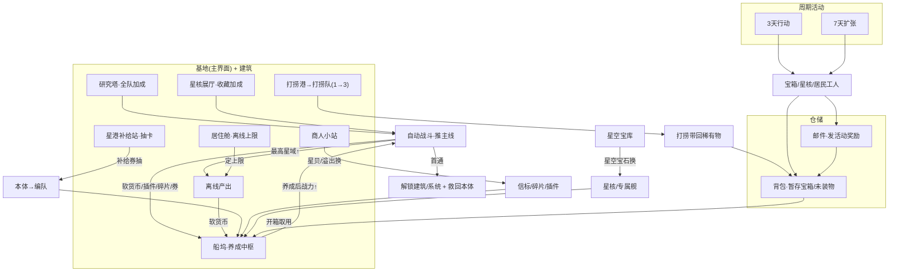

# 《我的星舰小队》设计可视化 v0.1（找漏洞用）

> 目的：把 v1.0 设计画成图，方便直观找**漏洞/断点/缺口**。依据=根文件 `系统玩法设计-v1.0.md`。
> 看图方法：① push 后在 GitHub 网页打开本文件（自动渲染 Mermaid）；② 或 VS Code 装「Markdown Preview Mermaid Support」插件预览。
> 4 张图：①主循环 ②资源经济流向 ③四层战斗数据流 ④系统联动总图。每张图下面附「重点检查啥」。

---

## 图① 主循环（玩家一天怎么转）

**重点检查**：失败后是否只回到「搭配/养成」而不是「操作时机」（v1.0 要求）；虚线那个「卡关→渴望→牛核→碾压→再卡」的爽点小循环有没有断点。

---

## 图② 资源经济流向（最容易看出漏洞的一张）

**重点检查**：每个货币是不是既有「进」又有「出」。只进不出 = 会溢出贬值；只出不进 = 会卡死拿不到。

---

## 图③ 四层战斗数据流（一个单位怎么组装出战斗力）

**重点检查**：四层职责有没有重叠（星舰=动作本体、驾驶员=怎么用/打谁、插件=纯数值、星核=质变）；驾驶员是不是真的「不自带独立技能、不加原始属性」。

---

## 图④ 系统联动总图（每个系统怎么互相喂）

**重点检查**：每个建筑/系统是不是都有「玩它的理由(产出)」和「它消耗啥」；解锁节奏(D1船坞→…→D7星核展厅)有没有断层。

---

## 我已经看出的几个可能缺口（供你看图时重点盯）

1. **星舰合金 / 驾驶记录 会不会后期溢出没处花**：它们只进(主线+离线)、只出(升星舰/升驾驶员)，而 v1.0 §10.3 明确这俩「不可回收」。等单位都养满，产出还在涨 → 可能堆着贬值。要不要给个后期 sink（比如转通用碎片/兑星贝）？
2. **星贝的唯一出口是商人小站**：如果商人能买的东西有限，星贝(还含星矿溢出转化)可能堆积。商人的购买量/刷新够不够吃掉星贝？
3. **专属碎片依赖抽到本体**：没抽到某个本体就没它的专属碎片→升不动它，全靠「通用碎片」兜底。通用碎片来源(活动为主)够不够支撑非抽卡玩家升阶？
4. **图②里 adv(广告) 的位置**：通关翻倍、打捞加速这两个广告点改的是「掉落量/时间」，不是新增货币种类，所以图上没单独连线——确认这符合你「广告只让更舒服、不新增战力」的红线。
5. **(已记的旧账)** n001 还是分批刷怪，与 v1.0「一次性刷新」冲突；留内容阶段处理。

---

> 看完告诉我：哪张图发现了断点/缺口、要不要我补画或拆细某一块；确认无误后再回去开「块1 效果装配层」。
